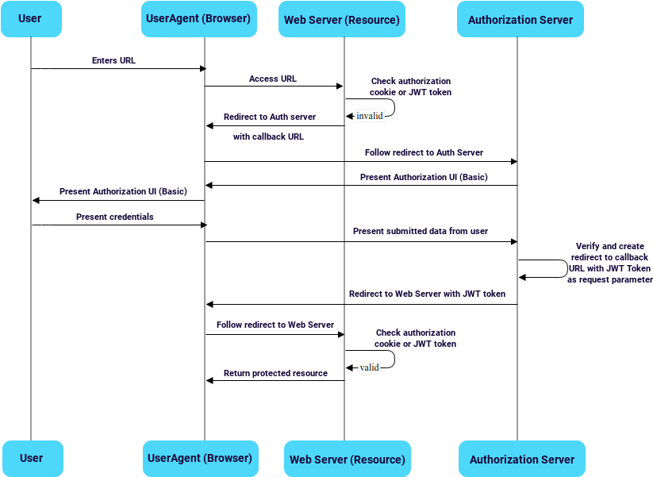

# Spring Boot JWT application

Spring Boot JWT sample application is designed to incorporate a Resource Server and an Auth Server in one application, with separated logic and flows.

## Overview

The authorization flow is implemented by following the OAuth 2.0 specification. As the client is represented by a browser in our scenario which cannot store the users's credentials in a secure way, the Implicit grant is used to return the token directly. 
More about OAuth2 specification and flows [here](https://github.com/digital-consulting/oauth2) 

 

## Resource (Web) server

The Resource Server's endpoints are protected from external request and are only accessible with valid JWT token emitted by the Auth Server.
The verification process consists in a filter chain containing the following two filters:
* **Cookie verification filter**: for every incoming request for the protected resources Cookie is verified first. If it exists and it contain a valid JWT token, authorization is successful, else the filter chain jumps to the following filter: 
* **JWT token verification filter**: if no successful Cookie authorization happened before the token verification filter checks if a valid JWT token is present as URL parameter. If not, the filter redirects to the Auth server, otherwise authentication is considered successful and a JWT token is set on the Cookie.
 
## Auth server

The Auth server uses a Basic authentication with an implicit full access authorization for every successfully authenticated user. With the obtained token all of the protected resources of the Resource Server are accessible.   

## How to test/run:

1. Start the application via IDE, running SpringBootJwtApplication.main, or by command line: java -jar build/libs/spring-boot-jwt-0.0.1-SNAPSHOT.jar;
1. Access the secured endpoint via: http://localhost:8081/tasks;
2. User is redirected to /users/login if no JWT Token is provided;
3. The /users/login endpoint is secured by basic authentication, so the user has to authenticate before being able to access the protected endpoint: Username: test, Password: test;
4. In case of successful authentication the server provides a JWT token and will redirect to the /tasks endpoint with the token as request parameter;
5. In case of valid JWT token the server will respond with a JSON response and add a cookie with the included token, otherwise will redirect to basic authentication;
6. For further requests (for ex: refresh page) the token from the cookie will be verified first. It can be checked by removing the token request parameter from the URL.

