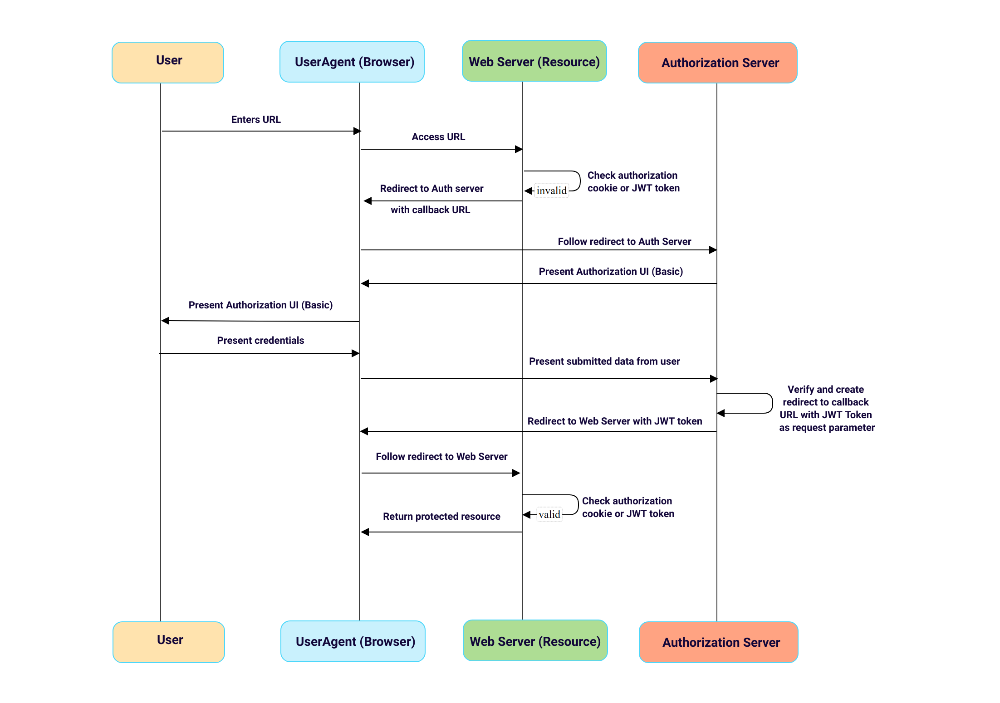

# Sample Spring Boot JWT application

The sample application's goal is to have a Resource Server and an Auth Server in one application, but with separated logic and flows.

## Overview

## Resource server

The Resource Server's endpoints are protected from external request, are only accessible with valid JWT token emitted by the Auth Server.
The verification process consists in a filter chain containing the following two filters:
* **Cookie verification filter**: in case of previous successful token authorization a token is set in the Cookie and for further request the Cookie is verified first. If it exists and it contain a valid JWT token, authorization is successful; 
* **JWT token verification filter**: if no successful Cookie authorization happened before the token verification filter checks if a valid JWT token is present as URL parameter. If not, the filter redirects to the Auth server.
 
## Auth server

The Auth server uses a Basic authentication with an implicit full access authorization for every successfully authenticated user. With the obtained token all of the protected resources of the Resource Server are accessible.   

